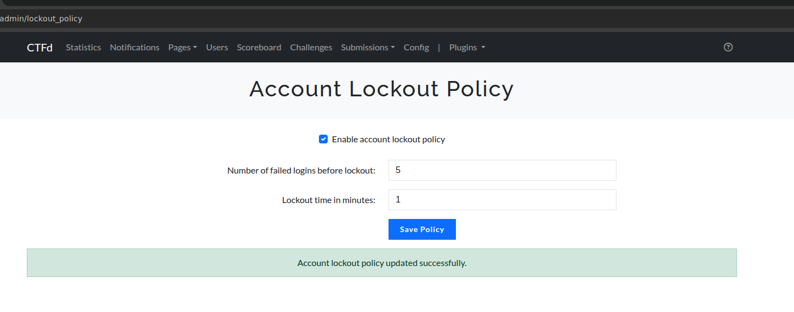
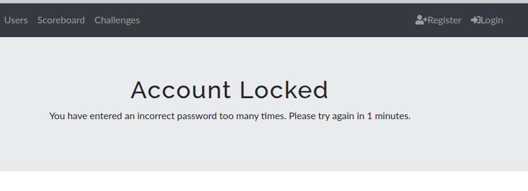

# CTFd-plugin_password-policy
Allows you to set an account lockout policy in CTFd. This will prevent brute-force attacks on the users.   
Both the lockout time as well as the failed attempts are configurable.

## Installation
Copy the `account_lockout_policy` folder into the `CTFd/CTFd/plugins/` directory and restart CTFd.

## Example:

